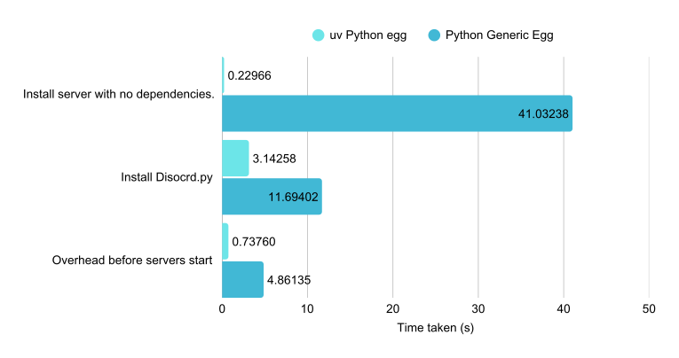

# UV Python Egg - 一個極快的 Pterodactyl/Pelican Eggs 及 Yolks 映像 


[English](README.md) | 繁體中文

## 特點
- 比[普通的 Python Egg](https://github.com/pelican-eggs/generic/tree/main/python) 快 180+ 倍的伺服器安裝速度、10-100 倍的套件安裝速度。
- 同時支援傳統的 pip 工作流程和現代的 uv 套件管理流程。
- 安裝容器優化，預裝建置依賴，避免不必要的安裝造成時間浪費。
- 允許用戶從 Github 儲存庫拉取自己的 Python 原始碼。




## 快速開始

### 匯入 Egg 配置

根據您的面板類型選擇 egg 檔案：

#### Pelican 面板（推薦）
```
https://raw.githubusercontent.com/Dong-Chen-1031/UV-Python-Egg/refs/heads/master/egg/egg-python-uv.json
```

#### Pterodactyl 面板
```
https://raw.githubusercontent.com/Dong-Chen-1031/UV-Python-Egg/refs/heads/master/egg/egg-pterodactyl-python-uv.json
```

**匯入步驟：**
1. 在您的管理面板中，導航至 **Egg** → **Import Egg**
2. 在匯入欄位中貼上上方適當的 URL
3. 點擊匯入，egg 將自動配置完成

**替代下載方式：**
- [Pelican: egg-python-uv.json](https://raw.githubusercontent.com/Dong-Chen-1031/UV-Python-Egg/refs/heads/master/egg/egg-python-uv.json)
- [Pterodactyl: egg-pterodactyl-python-uv.json](https://raw.githubusercontent.com/Dong-Chen-1031/UV-Python-Egg/refs/heads/master/egg/egg-pterodactyl-python-uv.json)

### 部署您的應用程式

匯入 egg 後：
1. 使用「UV Python」egg 建立新伺服器
2. 從 Docker 映像下拉選單中選擇所需的 Python 版本
3. 選擇 Dependency Install Mode：
   - **pip**（預設）：使用 requirements.txt + Additional Python packages，透過 `uv pip install`
   - **uv**：使用 pyproject.toml + uv.lock，透過 `uv sync`
4. 配置其他環境變數（如 GIT_ADDRESS、PY_FILE 等）
5. 啟動您的伺服器，應用程式將自動部署
>[!TIP]
> 請注意，修改 Git 儲存庫後，伺服器需要重新安裝以應用變更。

## 原理
本專案的優化方式主要分為兩種
### 1. 使用 uv 套件管理器以加快套件安裝速度
[uv](https://github.com/astral-sh/uv) 是 pip 的替代品，提供：
- 10-100 倍更快的套件安裝速度
- 更好的依賴解析
- 改進的快取機制
- 以 Rust 編寫，實現最佳效能
### 2. 安裝容器優化，預裝建置依賴，避免不必要的安裝造成時間浪費
#### [Python Generic Egg](https://github.com/pelican-eggs/generic/tree/main/python) 安裝流程：
- 使用 `python:3.12-slim-bookworm` 映像當作安裝容器
- 於安裝腳本執行 `apt-get install` 安裝眾多建置依賴
- 每次安裝都需重新下載並安裝這些依賴，導致安裝時間過長
#### 本專案安裝流程：
- 使用專用的 `ghcr.io/dong-chen-1031/yolks:python_uv_installer` 映像當作安裝容器
- 該映像預裝所有常用的建置依賴
- 避免每次安裝都需重新下載和安裝這些依賴，縮短安裝時間約 170 倍。
> [!NOTE]
> 此種雙映像架構本來存在，如 Python Generic Egg 於安裝過程使用 `python:3.12-slim-bookworm`，執行時使用 `ghcr.io/parkervcp/yolks:python_3.xx`，因此不存在而外安裝映像消耗儲存空間的問題。

透過這兩種優化方式，顯著提升了 Python 應用程式在 Pterodactyl 和 Pelican 面板上的部署速度和效能。

## 功能特性

### 核心功能
- **UV 套件管理器**：以 Rust 編寫的極速 Python 套件安裝器和解析器（比 pip 快 10-100 倍）
- **雙重安裝模式**：
  - **pip 模式**：使用 requirements.txt 的 `uv pip install`（傳統工作流程）
  - **uv 模式**：使用 pyproject.toml + uv.lock 的 `uv sync`（現代專案管理）
- **多版本支援**：支援 Python 3.8 到 3.14 版本
- **多架構支援**：可用於 `linux/amd64` 和 `linux/arm64`

### 安全性與可靠性
  - 安裝使用具有所有依賴的 root 容器
  - 運行使用非 root 容器以增強安全性

### 開發者體驗
- **自動更新**：內建支援啟動時自動更新 git 儲存庫
- **靈活的依賴管理**：支援 requirements.txt、pyproject.toml 或直接安裝套件
- **CI/CD 就緒**：GitHub Actions 工作流程自動定期建置映像，並自動定期重建以確保使用最新依賴。

## 配置選項

eggs 透過環境變數支援全面的配置：

### 核心設定
- **GIT_ADDRESS**：您的 git 儲存庫 URL（例如：`https://github.com/username/repo`）
- **BRANCH**：要複製的特定分支（選填，預設為儲存庫的預設分支）
- **USERNAME/ACCESS_TOKEN**：Git 身份驗證憑證（用於私有儲存庫）
- **AUTO_UPDATE**：啟用啟動時自動 git pull（`0` = 停用、`1` = 啟用）
- **USER_UPLOAD**：如果您手動上傳檔案，則整個安裝腳本。

### Python 配置
- **PY_FILE**：要執行的主要 Python 檔案（預設：`app.py`）
- **DEPENDENCY_INSTALL_MODE**：選擇依賴安裝方法
  - `pip`（預設）：使用 `uv pip install` 搭配 requirements.txt + 額外套件
  - `uv`：使用 `uv sync` 搭配 pyproject.toml（忽略 requirements.txt 和 PY_PACKAGES）

### 套件管理（僅限 pip 模式）
- **REQUIREMENTS_FILE**：Requirements 檔案名稱（預設：`requirements.txt`）
- **PY_PACKAGES**：要安裝的額外套件（以空格分隔，例如：`flask requests`）

### UV 模式（當 DEPENDENCY_INSTALL_MODE=uv 時）
使用 uv 模式時，依賴透過以下方式管理：
- **pyproject.toml**：專案配置和直接依賴
- **uv.lock**：鎖定的依賴版本（由 uv 自動生成）
- 環境：`/home/container/.local/uv`（透過 UV_PROJECT_ENVIRONMENT 設定）
  
> [!WARNING]  
> 使用 uv 模式時，pyproject.toml中的 Python 版本設定不會被應用，請確保您的專案與所選的運行時映像版本相容。

## 可用映像

所有映像均託管於 GitHub Container Registry (ghcr.io)，並為 amd64 和 arm64 架構建置。

### 運行時映像（Python with UV）

* [`python_uv_3.14`](/python_uv/3.14) - Python 3.14 with UV
  * `ghcr.io/dong-chen-1031/yolks:python_uv_3.14`
* [`python_uv_3.13`](/python_uv/3.13) - Python 3.13 with UV  
  * `ghcr.io/dong-chen-1031/yolks:python_uv_3.13`
* [`python_uv_3.12`](/python_uv/3.12) - Python 3.12 with UV
  * `ghcr.io/dong-chen-1031/yolks:python_uv_3.12`
* [`python_uv_3.11`](/python_uv/3.11) - Python 3.11 with UV
  * `ghcr.io/dong-chen-1031/yolks:python_uv_3.11`
* [`python_uv_3.10`](/python_uv/3.10) - Python 3.10 with UV
  * `ghcr.io/dong-chen-1031/yolks:python_uv_3.10`
* [`python_uv_3.9`](/python_uv/3.9) - Python 3.9 with UV
  * `ghcr.io/dong-chen-1031/yolks:python_uv_3.9`
* [`python_uv_3.8`](/python_uv/3.8) - Python 3.8 with UV
  * `ghcr.io/dong-chen-1031/yolks:python_uv_3.8`

### 安裝器映像

* [`python_uv_installer`](/python_uv/installer) - 專用安裝環境
  * `ghcr.io/dong-chen-1031/yolks:python_uv_installer`
  * 基於 Python 3.12，包含所有建置依賴
  * 以 root 身份執行以進行套件編譯
  * 僅在 egg 安裝階段使用

## 建置與開發

### 自動化建置

映像透過 GitHub Actions 工作流程自動建置：

#### 運行時映像 ([.github/workflows/python.yml](.github/workflows/python.yml))
- **觸發條件**：推送到 `python_uv/3.*/**`、每週排程（週一）、手動調度
- **輸出**：`ghcr.io/dong-chen-1031/yolks:python_uv_3.{8-14}`
- **架構**：linux/amd64、linux/arm64

#### 安裝器映像 ([.github/workflows/installer.yml](.github/workflows/installer.yml))
- **觸發條件**：推送到 `python_uv/installer/**`、每週排程（週一）、手動調度
- **輸出**：`ghcr.io/dong-chen-1031/yolks:python_uv_installer`
- **架構**：linux/amd64、linux/arm64

#### Egg 生成 ([.github/workflows/hen.yml](.github/workflows/hen.yml))
- **觸發條件**：推送到 `script/install.sh`、`script/start.sh`、`script/hens/**`、`script/hen.py`、手動調度
- **過程**：執行 `hen.py` 從模板重新生成 eggs
- **輸出**：自動提交更新的 eggs 到 `egg/` 目錄

### 本地建置

建置運行時映像：
```bash
docker build -t python_uv:3.13 ./python_uv/3.13
```

建置安裝器映像：
```bash
docker build -t python_uv_installer ./python_uv/installer
```

在本地生成 eggs：
```bash
cd script
python3 hen.py
```

### 開發工作流程

1. **修改腳本**：編輯 `script/install.sh` 或 `script/start.sh`
2. **更新模板**：如需要，修改 `script/hens/` 中的 egg 模板
3. **本地測試**：執行 `python3 hen.py` 驗證生成
4. **推送變更**：GitHub Actions 自動重新生成並提交 eggs
5. **禁止手動編輯 Egg**：永遠不要直接編輯 `egg/` 中的檔案 - 它們是自動生成的！

## 專案結構

```
UV-Python-Egg/
├── .github/workflows/
│   ├── python.yml          # 建置運行時映像（3.8-3.14）
│   ├── installer.yml       # 建置安裝器映像
│   └── hen.yml            # 從模板自動生成 eggs
├── python_uv/
│   ├── 3.8/ ... 3.14/     # 運行時映像 Dockerfiles
│   └── installer/         # 安裝器映像 Dockerfile
├── script/
│   ├── hens/              # Egg 模板（真實來源）
│   │   ├── egg-python-uv.json              # Pelican 模板
│   │   └── egg-pterodactyl-python-uv.json  # Pterodactyl 模板
│   ├── hen.py             # Egg 生成器（母雞 🐔）
│   ├── install.sh         # 安裝腳本
│   └── start.sh           # 啟動腳本
├── egg/                   # 生成的 eggs（請勿編輯）
│   ├── egg-python-uv.json              # 自動生成的 Pelican egg
│   └── egg-pterodactyl-python-uv.json  # 自動生成的 Pterodactyl egg
├── LICENSE.md
└── README.md
```

## 授權條款

詳見 [LICENSE.md](LICENSE.md)。

## 致謝

- **Yolks**：基於 [Pelican Eggs Yolks](https://github.com/pelican-eggs/yolks) 並整合 UV
- **Egg 配置**：基於 [Pelican Eggs Generic](https://github.com/pelican-eggs/generic) 並增強 UV 支援
- **UV 套件管理器**：[astral-sh/uv](https://github.com/astral-sh/uv) - 極快的 Python 套件安裝器和解析器

## 連結

- **儲存庫**：[Dong-Chen-1031/UV-Python-Egg](https://github.com/Dong-Chen-1031/UV-Python-Egg)
- **Docker 映像**：[ghcr.io/dong-chen-1031/yolks](https://github.com/Dong-Chen-1031/UV-Python-Egg/pkgs/container/yolks)
- **上游專案**：
  - [Pelican Eggs](https://github.com/pelican-eggs)
  - [UV Package Manager](https://github.com/astral-sh/uv)
  - [Pelican Panel](https://pelican.dev/)

